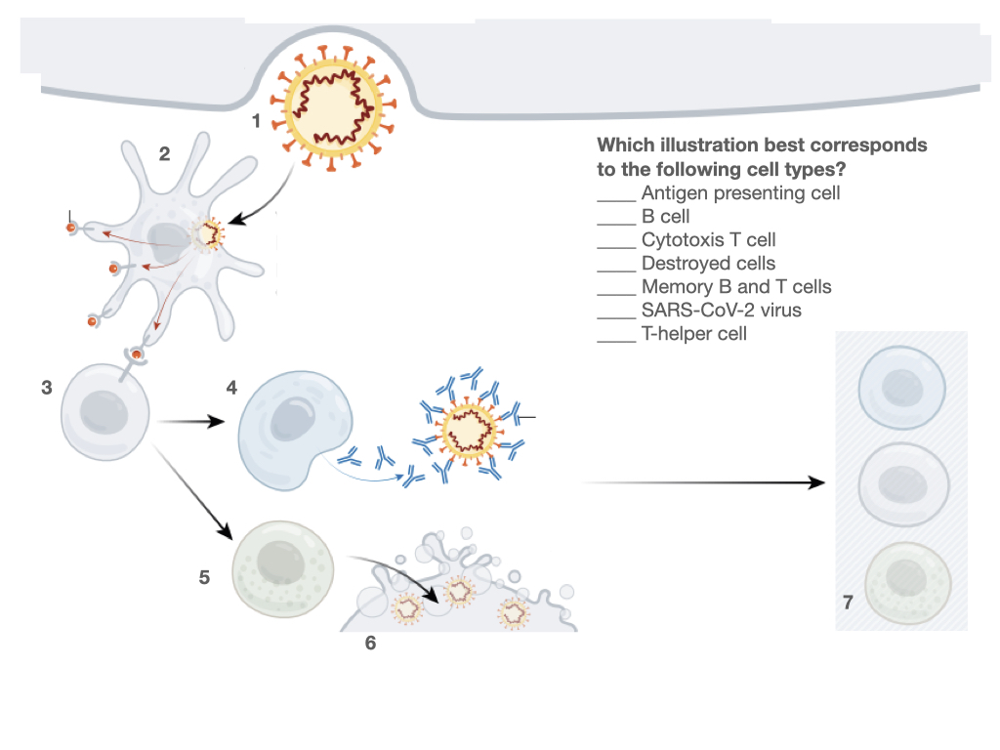
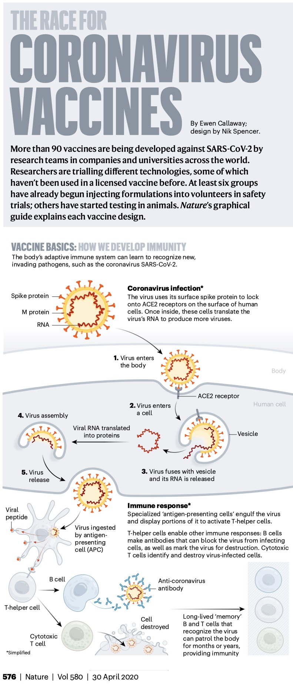

# Activation of adaptive immunity by elements of the innate immune system

<!---
Remember: Recall facts and concepts. Define, duplicate, memorize, repeat, and state.
Understand: Explain ideas or concepts. Classify, describe, explain, select.
Apply: Use information in new situations. Execute, solve, interpret, sketch.
Analyze: Draw connections among ideas. Organize, compare, contrast, examine.
Evaluate: Justify a stand or decision. Argue, defend, critique.
Create: Produce new or original work. Design, develop, formulate, investigate.
--->

## Learning Objectives

- Classify elements of the innate and adaptive immune systems
- Explain how animal cells recognize invading microbes
- Defend the use of vaccines to protect against infectious diseases
- Discuss experiments to test socio-economic and biomedically relevant factors that influence immune system function

## Pre-Lesson Question

Understanding how we develop immunity is critical to understanding how vaccines work. You may have learned about innate and adaptive immunity in previous classes or through the news. 

<figure>

<figcaption><b>Can you label elements of the innate immune system in this illustration from memory?</b>   Antigen presenting cell - B cell -
Cytotoxic T cell - Destroyed cell - Memory B and T cells - SARS-CoV-2 - T-helper cell.   <a href="https://media.nature.com/original/magazine-assets/d41586-020-01221-y/d41586-020-01221-y.pdf">Adapted from Nature Illustration by Nik Spencer.</a>

</figcaption>

</figure>

## Mechanisms of Innate and Adaptive Immunity

<figure>

<figcaption><b>Innate and adaptive immune responses. </b>Innate immune responses are activated directly by pathogens and defend all multicellular organisms against infection. In vertebrates, pathogens, together with the innate immune responses they activate, stimulate adaptive immune responses, which then help fight the infection. <a href="https://www.ncbi.nlm.nih.gov/books/NBK21070/figure/A4420/">Molecular Biology of the Cell (4th edition)</a>

</figcaption>

</figure>

<figure>

<figcaption><b>One way in which the innate immune system helps activate the adaptive immune system.</b> Specialized phagocytic cells of the innate immune system, including macrophages (not shown) and dendritic cells ingest invading microbes or their products at the site of infection. The dendritic cells then mature and migrate in lymphatic vessels to a nearby lymph node, where they serve as antigen-presenting cells. The antigen-presenting cells activate T cells to respond to the microbial antigens that are displayed on the presenting cells' surface. The antigen-presenting cells also have special proteins on their surface (called costimulatory molecules) that help activate the T cells. Some of the activated T cells then migrate to the site of infection where they either help activate macrophages or kill infected cells, thereby helping to eliminate the microbes. As we discuss later, the costimulatory molecules appear on dendritic cells only after these cells mature in response to invading microbes. <a href="https://www.ncbi.nlm.nih.gov/books/NBK26921/figure/A4427/">Molecular Biology of the Cell (4th edition)</a>

</figcaption>

</figure>

## Vaccines and Immunity

<figure>

<figcaption><b>The Race for Coronavirus Vaccines: a graphical guide. </b> <a href="https://media.nature.com/original/magazine-assets/d41586-020-01221-y/d41586-020-01221-y.pdf">By Ewen Callaway. Illustration by Nik Spencer.</a>

</figcaption>

</figure>

## Post Lesson Exercise

- **SciComm**: Explain to your neighbor why it takes longer for an unvaccinated person to mount an adaptive immune response to the coronavirus compared to a vaccinated person, all other factors considered equal. 
- **Biochem/Statics**: Design an experiment to test if there are any significant genetic or environmental factors influencing the response between two populations. 
- **Health/Environmental**: Compare and contrast the immune response of stressed and non-stressed individuals with those of immune-deficient individuals.

## References

- Alberts B, Johnson A, Lewis J, et al. Molecular Biology of the Cell. 4th edition. New York: Garland Science; 2002. <https://www.ncbi.nlm.nih.gov/books/NBK21054/>
- Callaway E. The Race for Coronavirus Vaccines (pdf). 2020. <https://www.nature.com/articles/d41586-020-01221-y> 