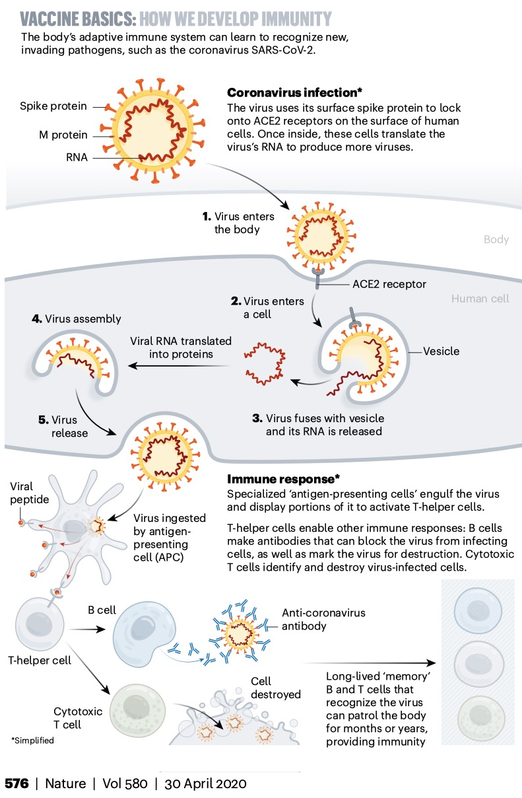

# Activation of adaptive immunity by elements of the innate immune system

<!---
Remember: Recall facts and concepts. Define, duplicate, memorize, repeat, and state.
Understand: Explain ideas or concepts. Classify, describe, explain, select.
Apply: Use information in new situations. Execute, solve, interpret, sketch.
Analyze: Draw connections among ideas. Organize, compare, contrast, examine.
Evaluate: Justify a stand or decision. Argue, defend, critique.
Create: Produce new or original work. Design, develop, formulate, investigate.
--->

## Learning Objectives

- Classify elements of the innate and adaptive immune systems
- Explain how animal cells recognize invading microbes
- Explain how vaccines protect against infectious diseases

## Pre-Lesson Quiz

Understanding how we develop immunity is critical to understanding how vaccines work. You may have learned about innate and adaptive immunity in previous classes or through the news. 

**Can you label elements of the innate and adaptive immune systems in this illustration from memory?**

Choose from the following: 
- Antigen-presenting cell 
- B cell 
- Cytotoxic T cell 
- Destroyed cell 
- Memory B and T cells 
- SARS-CoV-2 
- T-helper cell

<figure>

<figcaption><b>Fill in the blank graphical illustration.</b> <a href="https://media.nature.com/original/magazine-assets/d41586-020-01221-y/d41586-020-01221-y.pdf">Adapted from Nature Illustration by Nik Spencer.</a>

</figcaption>

</figure>

## Mechanisms of Innate and Adaptive Immunity

Innate immune responses are activated directly by pathogens. Innate immune responses and previously-encountered pathogens stimulate adaptive immune responses to help fight the infection. How does the innate immune system activate the adaptive immune system?

<figure>

<figcaption><b>Innate and adaptive immune responses.</b>   <a href="https://www.ncbi.nlm.nih.gov/books/NBK21070/figure/A4420/">Molecular Biology of the Cell (4th edition)</a>

</figcaption>

</figure>

<figure>

<figcaption><b>One way in which the innate immune system helps activate the adaptive immune system.</b>  <a href="https://www.ncbi.nlm.nih.gov/books/NBK26921/figure/A4427/">Molecular Biology of the Cell (4th edition)</a>

</figcaption>

</figure>

## Vaccines and Immunity

<figure>

<figcaption><b>The Race for Coronavirus Vaccines: a graphical guide. </b> <a href="https://media.nature.com/original/magazine-assets/d41586-020-01221-y/d41586-020-01221-y.pdf">By Ewen Callaway. Illustration by Nik Spencer.</a>

</figcaption>

</figure>

## Practice Biology GRE Questions

Which type of cell is responsible for making antibodies?

1. T-cells
1. B-cells
1. Macrophages
1. Basophils

Which cell is necessary to allow B-cells to differentiate into plasma cells and memory B-cells? 

1. Cytotoxic T-cells
1. Helper T-cells
1. Eosinophils
1. Macrophages

Which immune cell is part of acquired immunity?

1. Macrophage
1. Neutrophil
1. Plasma cell
1. Eosinophil

_[Click here for GRE answers.](answers.md)_

## Group Activities 

- Explain to your neighbor why it takes longer for an unvaccinated person to mount an adaptive immune response to the coronavirus compared to a vaccinated person. 
- Compare and contrast the immune response of healthy and immune-deficient individuals.
- Discuss what might happen to the efficacy of a vaccine if the microbe mutates.

## References

- Alberts B, Johnson A, Lewis J, et al. Molecular Biology of the Cell. 4th edition. New York: Garland Science; 2002. <https://www.ncbi.nlm.nih.gov/books/NBK21054/>
- Callaway E. The Race for Coronavirus Vaccines (pdf). 2020. <https://www.nature.com/articles/d41586-020-01221-y> 