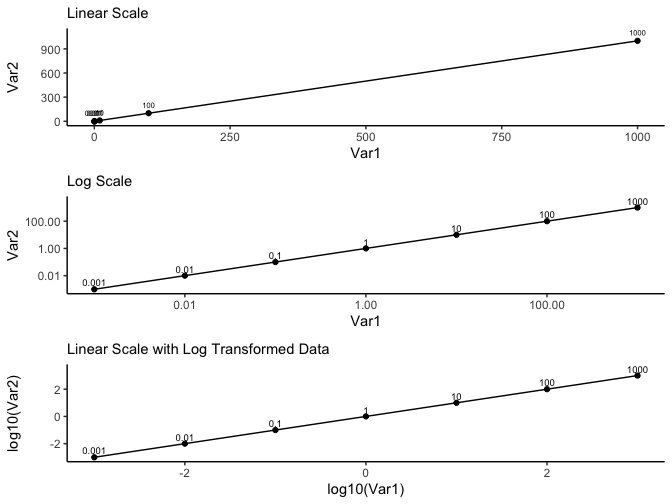
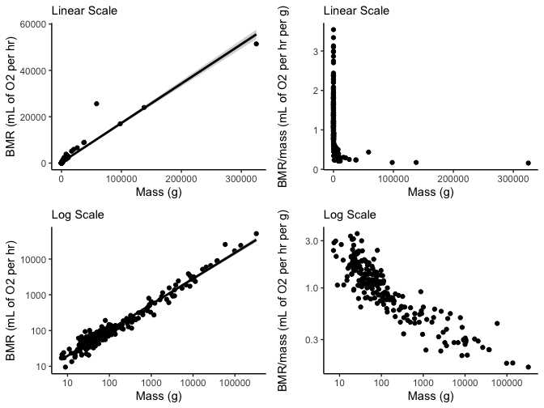

# Linear versus Log Scales and Log Tranformations

## Synthetic Data

    ##       Var1     Var2 logVar1 logVar2
    ## 1    0.001    0.001      -3      -3
    ## 2    0.010    0.010      -2      -2
    ## 3    0.100    0.100      -1      -1
    ## 4    1.000    1.000       0       0
    ## 5   10.000   10.000       1       1
    ## 6  100.000  100.000       2       2
    ## 7 1000.000 1000.000       3       3

## Experimental Data

Supporting information for White and Seymour (2003) Proc. Natl. Acad.
Sci. USA, 10.1073/pnas.0436428100

    ##        Family                Species   Mass Temp   BMR  BMR/Mass
    ## 1    Cervidae            Alces alces 325000 38.6 51419 0.1582123
    ## 2    Cervidae Odocoileus virginianus  58588 39.0 25609 0.4371032
    ## 3 Tayassuidae          Pecari tajacu  20500 37.5  5945 0.2900000
    ## 4     Canidae         Alopex lagopus   3600 38.6  1374 0.3816667
    ## 5     Canidae          Canis latrans  10000 37.0  2687 0.2687000
    ## 6     Canidae        Canis mesomelas   7720 38.0  3860 0.5000000

    ##      Family                     Species Mass Temp  BMR BMR/Mass
    ## 206 Muridae   Phyllotis darwini darwini 59.0 36.2 71.4 1.210169
    ## 207 Muridae Phyllotis darwini rupestris 36.0 37.1 45.4 1.261111
    ## 208 Muridae       Phyllotis xanthopygus 55.0 37.3 56.7 1.030909
    ## 209 Muridae   Pseudomys gracilicaudatus 79.8 36.8 83.8 1.050125
    ## 210 Muridae Pseudomys hermannsburgensis 12.2 37.8 23.3 1.909836
    ## 211 Muridae             Rattus fuscipes 76.0 37.5 84.4 1.110526

